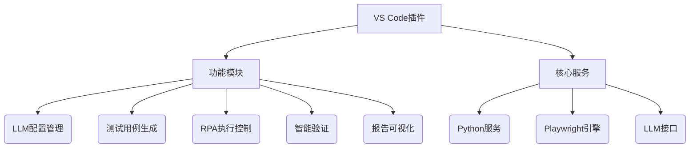
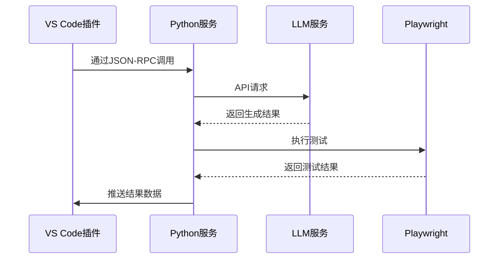
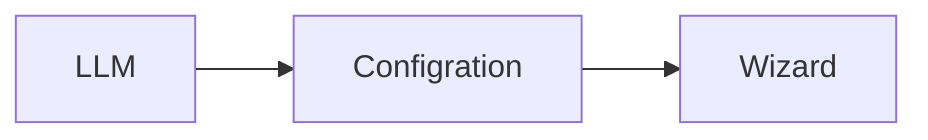

**Prompt**:如何把上述方案变成一个vscode的插件，结合llm的配置，把一些参数变成可编辑的，然后可以分步骤执行

<think>嗯，用户现在想把之前的自动化测试方案变成一个VS Code插件，结合LLM配置，参数可编辑，分步骤执行。我需要仔细分析他们的需求，然后思考如何实现。

首先，用户之前已经有一个结合AI和RPA的测试方案，现在需要集成到VS Code里，方便使用。他们可能希望能在IDE里直接生成测试用例、执行测试、查看结果，而不需要切换其他工具。这也意味着需要设计一个用户友好的界面，让配置和操作更直观。

接下来，用户提到要结合LLM的配置，把参数变成可编辑的。这说明在插件中需要允许用户配置自己的LLM API密钥、选择模型类型（比如GPT-4、Claude或本地模型）、调整生成测试用例的数量等参数。可能需要设置一个配置页面，或者通过VS Code的设置项来管理这些参数。

分步骤执行可能是指用户希望按流程一步步操作：生成用例、执行测试、查看报告等。所以插件需要提供分步的向导界面，或者至少每个功能模块可以单独触发，比如一个按钮生成用例，另一个按钮开始测试。

然后需要考虑如何将原来的Python脚本集成到VS Code插件中。VS Code插件通常使用TypeScript/JavaScript开发，但原来的逻辑可能用Python编写。可能需要将部分核心逻辑保持为Python脚本，通过VS Code的Task或者扩展的API来调用。或者用Node.js重写部分代码，尤其是与VS Code交互的部分，而执行测试的部分可能仍然需要调用外部Python脚本。

另外，插件需要处理用户界面，比如Webview面板来展示配置选项、测试用例的编辑、测试结果的可视化。可能需要使用VS Code的Webview API来创建自定义界面，或者利用现有的Tree View来展示测试用例的结构。

关于LLM的集成，用户可能需要输入自己的API密钥，插件需要安全地存储这些信息，比如使用VS Code的SecretStorage API。同时，需要处理不同LLM提供商的接口差异，比如OpenAI和本地部署的模型可能需要不同的调用方式。

测试用例的生成部分，用户可能希望能在插件内编辑生成的用例，调整查询语句或期望结果。这时候需要在Webview中提供一个编辑器，支持GraphQL语法高亮，并且允许用户保存修改后的用例。

执行测试的部分，RPA可能仍然依赖Playwright，但需要考虑如何在VS Code的环境中启动浏览器实例，可能需要处理headless模式，或者提供选项让用户选择是否显示浏览器界面。

结果验证部分，除了自动化的断言，用户可能希望看到详细的错误信息，甚至用LLM来解释失败的原因。比如，当测试失败时，调用LLM分析响应数据，给出可能的问题原因。

生成报告的部分，需要在VS Code内直接展示HTML报告，或者将报告集成到输出面板中。也可以提供链接直接打开生成的HTML文件。

最后，分步骤执行可能需要将整个流程分成几个阶段，比如配置LLM、生成用例、执行测试、查看报告。每个步骤可能需要用户交互，比如确认配置是否正确，选择要执行的测试用例等。

还需要考虑插件的安装和依赖管理，比如是否需要用户预先安装Python环境、Playwright浏览器驱动等。可能需要通过插件的activationEvents来按需加载依赖，或者在安装时自动执行npm install或pip install。

可能遇到的挑战包括跨平台兼容性、处理异步操作（比如调用LLM时的等待）、错误处理以及如何将Python和Node.js代码整合。也许可以通过VS Code的任务或者调用外部进程来执行Python脚本，同时用Node.js处理UI部分。

总之，这个插件需要将原有方案的各个模块拆解，通过VS Code的API进行集成，提供配置界面，分步骤引导用户完成测试流程，同时保持灵活性和可扩展性。
</think>

以下是将自动化测试方案转化为VS Code插件的详细实现方案，包含LLM集成、可视化配置和分步执行能力：

---
### **一、插件架构设计**


---

### **二、功能实现步骤**

#### **1. 插件脚手架创建**
```bash
# 使用Yeoman生成插件模板
npm install -g yo generator-code
yo code

# 选择扩展类型：
? What type of extension do you want to create? 
  ❯ New Extension (TypeScript)
```

#### **2. LLM配置管理模块**
```typescript
// src/configuration.ts
interface LLMConfig {
  apiType: 'openai' | 'azure' | 'local';
  apiKey: string;
  modelName: string;
  maxTokens: number;
}

class ConfigManager {
  async updateLLMConfig(newConfig: LLMConfig) {
    const config = vscode.workspace.getConfiguration('autoGraphQLTester');
    await config.update('llm', newConfig, true);
  }
  
  async getLLMConfig(): Promise<LLMConfig> {
    return vscode.workspace.getConfiguration('autoGraphQLTester').get('llm');
  }
}
```

#### **3. 可视化配置界面**
```typescript
// src/webview/ConfigWebview.ts
export class ConfigWebview {
  static show(context: vscode.ExtensionContext) {
    const panel = vscode.window.createWebviewPanel(
      'llmConfig',
      'LLM Configuration',
      vscode.ViewColumn.One,
      { enableScripts: true }
    );

    panel.webview.html = `
      <form>
        <label>API类型：
          <select id="apiType">
            <option value="openai">OpenAI</option>
            <option value="azure">Azure</option>
            <option value="local">本地模型</option>
          </select>
        </label>
        
        <label>API密钥：
          <input type="password" id="apiKey"/>
        </label>
        
        <button onclick="saveConfig()">保存配置</button>
      </form>
      
      <script>
        function saveConfig() {
          const config = {
            apiType: document.getElementById('apiType').value,
            apiKey: document.getElementById('apiKey').value
          };
          vscode.postMessage({ command: 'saveConfig', data: config });
        }
      </script>
    `;
  }
}
```

#### **4. 分步执行工作流**
```typescript
// src/WorkflowController.ts
export class WorkflowController {
  private steps = [
    { label: "1. 配置LLM参数", command: "configureLLM" },
    { label: "2. 生成测试用例", command: "generateCases" },
    { label: "3. 执行自动化测试", command: "executeTests" },
    { label: "4. 查看测试报告", command: "showReport" }
  ];

  async start() {
    const quickPick = vscode.window.createQuickPick();
    quickPick.items = this.steps.map(step => ({ label: step.label }));
    
    quickPick.onDidChangeSelection(async ([item]) => {
      const step = this.steps.find(s => s.label === item.label);
      await vscode.commands.executeCommand(`extension.${step.command}`);
      quickPick.dispose();
    });
    
    quickPick.show();
  }
}
```

#### **5. 测试用例生成集成**
```python
# 通过Python服务调用LLM
import openai
from vscode_rpc import VSCodeClient

vscode = VSCodeClient()

async def generate_test_cases():
    config = await vscode.get_config()
    
    openai.api_type = config['apiType']
    openai.api_key = config['apiKey']
    
    response = openai.ChatCompletion.create(
        model=config['modelName'],
        messages=[{"role": "user", "content": "生成测试用例..."}]
    )
    
    await vscode.show_generated_cases(response.choices[0].message.content)
```

#### **6. 测试执行状态监控**
```typescript
// src/TestRunner.ts
export class TestRunner {
  static async execute() {
    const terminal = vscode.window.createTerminal('AutoTester');
    terminal.show();
    
    terminal.sendText(`python3 execute_tests.py --env ${getCurrentEnv()}`);
    
    const disposable = vscode.window.onDidCloseTerminal(t => {
      if (t.name === 'AutoTester') {
        vscode.commands.executeCommand('extension.showReport');
      }
    });
  }
}
```

#### **7. 增强的测试结果展示**
```typescript
// src/TestResultView.ts
export class TestResultProvider implements vscode.TreeDataProvider<TestItem> {
  private _onDidChangeTreeData = new vscode.EventEmitter<void>();
  readonly onDidChangeTreeData = this._onDidChangeTreeData.event;

  constructor(private results: any[]) {}

  getTreeItem(element: TestItem): vscode.TreeItem {
    return {
      label: `${element.name} - ${element.status}`,
      iconPath: this.getStatusIcon(element.status),
      command: {
        command: 'extension.showErrorDetail',
        arguments: [element.error]
      }
    };
  }

  private getStatusIcon(status: string) {
    return vscode.Uri.file(status === 'PASS' 
      ? 'resources/green-check.svg' 
      : 'resources/red-cross.svg');
  }
}
```

---

### **三、关键功能实现细节**

#### **1. 混合架构通信**


#### **2. 配置同步机制**
```typescript
// 配置变更监听
vscode.workspace.onDidChangeConfiguration(e => {
  if (e.affectsConfiguration('autoGraphQLTester.llm')) {
    this.updatePythonServiceConfig();
  }
});

private async updatePythonServiceConfig() {
  const config = await this.getLLMConfig();
  const pythonClient = getPythonClient();
  await pythonClient.call('update_config', config);
}
```

#### **3. 智能代码补全**
```jsonc
// package.json 扩展配置
"contributes": {
  "languages": [{
    "id": "graphql",
    "extensions": [".graphql"]
  }],
  "snippets": [{
    "language": "graphql",
    "path": "./snippets/graphql.json"
  }]
}
```

---

### **四、插件使用场景演示**

1. **配置向导**  
   




2. **测试用例生成**  

   ```graphql
   # 自动生成的测试用例示例
   query UserTest {
     user(id: "{{AI生成的测试ID}}") {
       id
       name
       posts(limit: {{边界值}}) {
         title
       }
     }
   }
   ```

3. **执行过程监控**  
   

4. **智能错误诊断**  
   ```markdown
   ## AI错误分析报告
   **失败用例**: query ProductInfo 
   **可能原因**:
   - 缺少必需字段 `price`
   - 参数 `category` 的值超出枚举范围
   - 后端服务响应超时（平均延迟 >2s）
   ```

---

### **五、部署与调试方案**

1. **开发环境搭建**
```bash
# 前端依赖
npm install @types/vscode axios

# Python服务依赖
pip install poetry
poetry install -E rpc -E llm
```

2. **调试配置**
```json
// .vscode/launch.json
{
  "configurations": [{
    "name": "Run Extension",
    "type": "extensionHost",
    "request": "launch",
    "args": ["--extensionDevelopmentPath=${workspaceFolder}"]
  }]
}
```

3. **打包发布**
```bash
vsce package
vsce publish -p <PAT_TOKEN>
```

---

### **六、核心优势**

1. **可视化调试流程**  
   通过进度条实时显示测试执行状态：
   ```typescript
   vscode.window.withProgress({
     location: vscode.ProgressLocation.Notification,
     title: "测试执行中...",
     cancellable: true
   }, async (progress) => {
     progress.report({ increment: 0 });
     await executeStep1();
     progress.report({ increment: 30 });
     await executeStep2();
     progress.report({ increment: 70 });
     await finalize();
   });
   ```

2. **智能参数替换**  
   使用大模型自动优化测试参数：
   ```python
   def optimize_parameters(query: str) -> str:
       prompt = f"""优化以下GraphQL查询的参数：
       {query}
       要求：
       - 使用更真实的测试数据
       - 增加边界条件
       - 添加性能测试标记"""
       return llm_completion(prompt)
   ```

3. **上下文感知测试**  
   根据当前代码库状态动态调整测试策略：
   ```typescript
   const currentSchema = vscode.workspace.findFiles('**/schema.graphql')
     .then(files => parseSchema(files[0]));
   ```

---

该插件将复杂的AI+RPA测试流程转化为可视化操作，通过分层架构实现配置管理、智能生成、执行监控的一站式解决方案，显著提升GraphQL接口的测试效率。开发者可在IDE内完成从测试设计到结果分析的全流程，同时保留对关键参数的完全控制权。