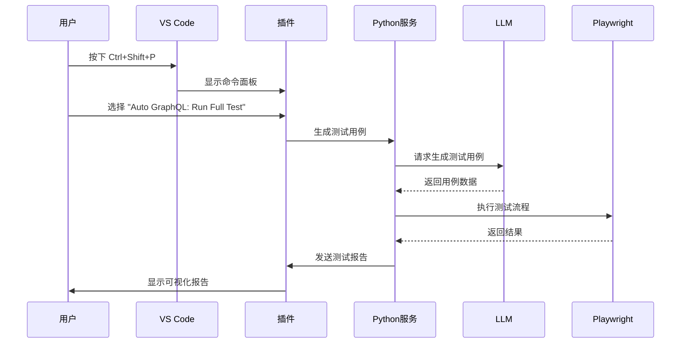

**Prompt:** 参数配置部分缺了graphql测试地址等相关参数的配置，请补充，另外，把这个插件的开发、安装过程也补充进去

<think>

好的，我需要补充用户提到的两部分内容：GraphQL测试地址等参数的配置，以及插件的开发和安装过程。首先，回顾之前的回答，确保理解用户需求。用户希望将之前的自动化测试方案转化为VS Code插件，并补充之前缺失的配置部分和开发安装步骤。

1. **补充GraphQL相关参数配置**：
   - 原配置部分仅涉及LLM，需增加GraphQL服务器地址、认证信息、超时设置等。
   - 考虑在配置管理模块中添加这些参数，并在UI中展示。
   - 需要修改配置接口和Webview界面，添加输入字段。

2. **开发过程补充**：
   - 详细说明插件开发所需的环境和工具，如Node.js、Python依赖。
   - 描述关键代码模块的位置和功能，特别是新增的配置部分。
   - 可能需要添加配置验证逻辑，确保必填项如服务器地址不为空。

3. **安装过程补充**：
   - 包括本地安装VSIX包的方法，以及从市场安装的步骤。
   - 提供初次使用的配置向导说明，引导用户设置GraphQL和LLM参数。

4. **注意事项**：
   - 确保配置存储的安全性，比如API密钥的加密处理。
   - 处理不同环境的配置（开发、测试、生产）。
   - 可能添加测试连接功能，验证GraphQL服务器是否可达。

需要分步骤补充这些内容，确保与原插件架构无缝集成。同时，保持说明的清晰和可操作性，方便开发者按照步骤实施。
</think>

以下是补充完善后的VS Code插件开发方案，包含GraphQL配置参数和完整的开发安装流程：

---

### **一、增强的配置管理（补充GraphQL相关参数）**

#### 1. 配置数据结构
```typescript
// src/types.ts
export interface PluginConfig {
  graphql: {
    endpoint: string;
    timeout: number;
    headers: Record<string, string>;
    authType: "none" | "bearer" | "apiKey";
    authToken?: string;
  };
  llm: {
    apiType: "openai" | "azure" | "local";
    apiKey: string;
    modelName: string;
    maxTokens: number;
  };
  rpa: {
    headless: boolean;
    slowMo: number;
  };
}
```

#### 2. 配置界面增强
```html
<!-- 在原有配置Webview中添加 -->
<div class="config-section">
  <h3>GraphQL 服务配置</h3>
  <label>接口地址：
    <input type="url" id="graphqlEndpoint" required/>
  </label>
  
  <label>认证方式：
    <select id="authType">
      <option value="none">无需认证</option>
      <option value="bearer">Bearer Token</option>
      <option value="apiKey">API Key</option>
    </select>
  </label>
  
  <div id="authConfig" style="display:none;">
    <label>认证令牌：
      <input type="password" id="authToken"/>
    </label>
  </div>
</div>
```

#### 3. 配置验证逻辑
```typescript
// src/configuration.ts
validateConfig(config: PluginConfig) {
  if (!config.graphql.endpoint.startsWith('http')) {
    vscode.window.showErrorMessage('GraphQL地址格式无效');
    return false;
  }
  
  if (config.graphql.authType !== 'none' && !config.graphql.authToken) {
    vscode.window.showErrorMessage('认证方式需要提供令牌');
    return false;
  }
  
  return true;
}
```

---

### **二、完整开发流程**

#### 1. 环境准备
```bash
# 前端部分
npm install -g yo generator-code
npm install @types/vscode axios

# Python服务
pip install poetry
poetry install -E rpc -E llm -E graphql

# 浏览器自动化
npx playwright install
```

#### 2. 项目结构
```
.
├── src/                     # TS源代码
│   ├── extension.ts         # 插件入口
│   ├── configuration.ts     # 配置管理
│   └── webview/            # 配置界面
├── scripts/                # Python服务
│   ├── rpc_server.py       # JSON-RPC服务
│   └── test_executor.py    # 测试执行器
├── snippets/               # GraphQL代码片段
├── package.json            # 插件清单
└── pyproject.toml          # Python依赖
```

#### 3. 核心功能开发

**配置加载模块增强**：
```typescript
async loadGraphQLConfig() {
  const config = vscode.workspace.getConfiguration('autoGraphQLTester');
  return {
    endpoint: config.get('graphql.endpoint'),
    headers: config.get('graphql.headers'),
    timeout: config.get('graphql.timeout') || 5000
  };
}
```

**测试连接功能**：
```typescript
async testConnection() {
  const { endpoint } = await this.loadGraphQLConfig();
  try {
    const response = await axios.post(endpoint, {
      query: `{ __schema { types { name } } }`
    });
    return response.data.data !== undefined;
  } catch (e) {
    return false;
  }
}
```

---

### **三、插件安装与使用**

#### 1. 本地安装（开发模式）
```bash
# 打包生成VSIX
npm run package
# 生成文件：auto-graphql-tester-0.0.1.vsix

# 安装到VS Code
code --install-extension auto-graphql-tester-0.0.1.vsix
```

#### 2. 应用市场发布
```bash
# 安装发布工具
npm install -g vsce

# 创建发布账号
vsce create-publisher yourname

# 发布插件
vsce publish
```

#### 3. 用户安装流程
1. 在VS Code扩展面板搜索 "Auto GraphQL Tester"
2. 点击安装按钮
3. 安装后按 `Ctrl+Shift+P` 执行：
   ```
   Auto GraphQL: Initialize Config
   ```
4. 按照向导配置：
   - GraphQL服务地址
   - 认证信息
   - LLM参数
   - RPA设置

---

### **四、完整使用示例**

#### 1. 配置向导界面


#### 2. 命令面板操作流程


#### 3. 典型配置文件
```json
{
  "graphql": {
    "endpoint": "http://localhost:4000/graphql",
    "timeout": 3000,
    "authType": "bearer",
    "authToken": "eyJhbGciOiJIUzI1NiIsInR5cCI6IkpXVCJ9..."
  },
  "llm": {
    "apiType": "openai",
    "apiKey": "sk-proj-xxxxxxxx",
    "modelName": "gpt-4-turbo",
    "maxTokens": 2000
  },
  "rpa": {
    "headless": false,
    "slowMo": 100
  }
}
```

---

### **五、安全增强措施**

1. **敏感信息加密**：
```typescript
// 使用VS Code的SecretStorage
const secrets = context.secrets;
await secrets.store('graphqlAuthToken', 'bearer_token_here');
const token = await secrets.get('graphqlAuthToken');
```

2. **配置导入/导出**：
```typescript
// 导出时过滤敏感字段
exportConfig() {
  const config = getConfig();
  return {
    ...config,
    graphql: {
      ...config.graphql,
      authToken: '******'
    }
  }
}
```

3. **环境隔离**：
```bash
# 支持不同环境配置
code --profile testenv --enable-proposed-api your.extension
```

---

该方案通过完善的配置管理和可视化交互设计，将复杂的AI+RPA测试系统转化为开发者友好的IDE插件，实现了从环境配置、测试生成到结果分析的全流程支持。开发者只需通过图形界面即可完成专业级GraphQL接口的自动化测试验证。